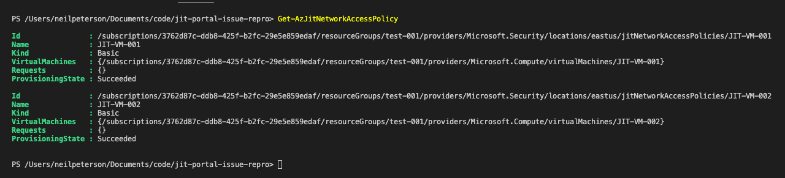
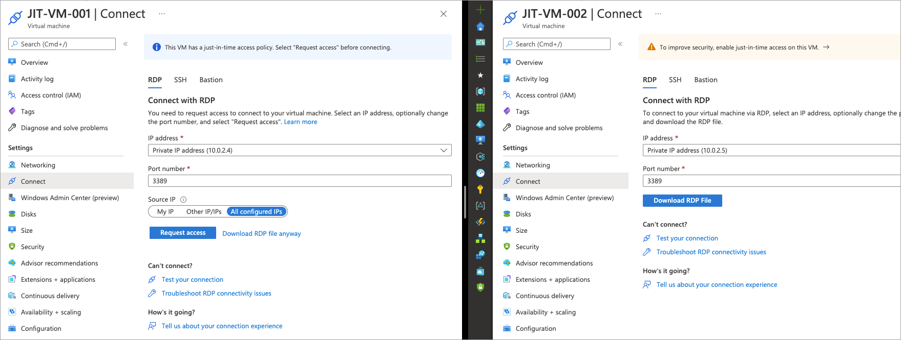
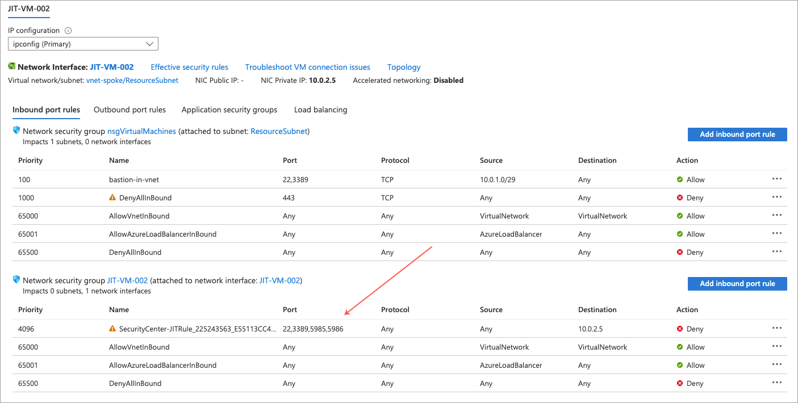
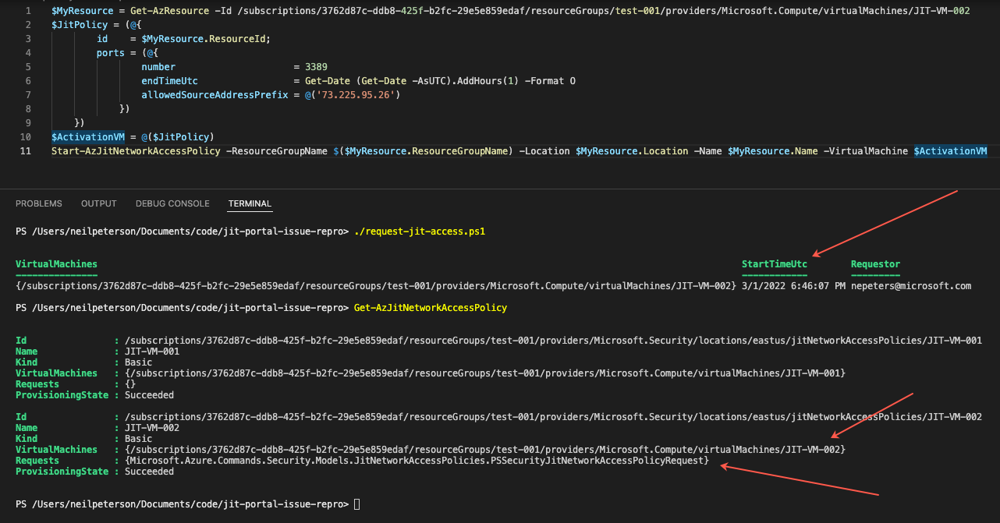
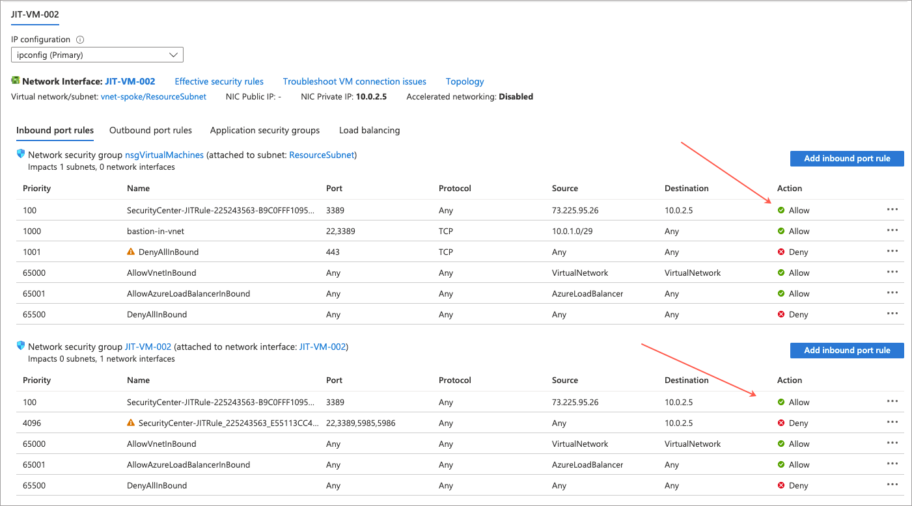

# Quick repro of JIT portal issue

Use deployment button to deploy repro:

# Observations

With this deployment, two virtual machines are created with the following attributes:

- Both are connected to a single VNET and a single subnet
- A NSG is attached to the subnet
- A second NSG per VM is attached to the VMs NIC
- A JIT rule is created for each VM (two in total)

One complete, we can see that the two JIT rules have been created. In the below screenshot, we can see a JIT rule for both VMs (**JIT-VM-001** and **JIT-VM-002**).

However, when navigating to the VMs through the Azure portal, only one appears to be JIT enabled (**JIT-VM-001**). Whereas **JIT-VM-002** does not appear to be JIT enabled.

That said, when looking at networking for **JIT-VM-002**, we can see the JIT created rule to deny management port access. So that looks good.

If using PowerShell against **JIT-VM-002** to request JIT access, the request is successful.

And, the expected allow NSG rule has been created.

## Other details

I have deployed these tempaltes withouth the JIT rules, and then attempted to enable using PowerSell one at a time. The first one worked great, and then when enabling the second, it works great however the first regressess back towads not showing as JIT enabled in the Azure portal.

## Conclusion

It seems like this is all working as expected on the back end / provider side. Perhaps this is a portal / UI bug? While we can manage access requests using PowerShell, this is not ideal for everyone on our team.